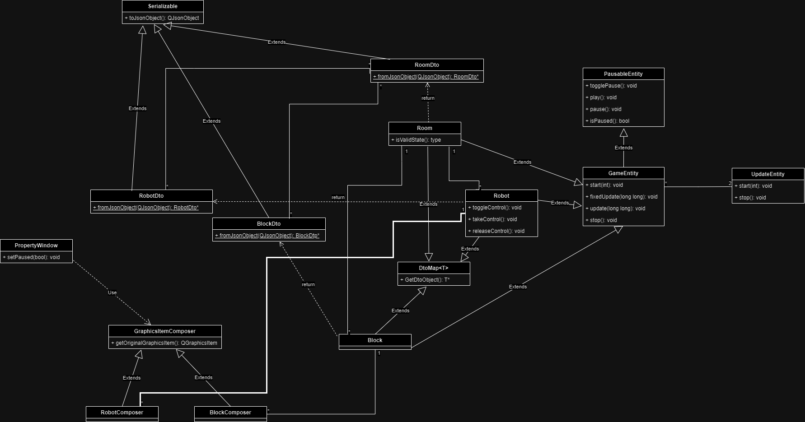

# Robots (ICP Project)

Author 1: xburlu00 <br>
Author 2: xbuten00 <br>

## Description

The task was to implement simulation tool for robots,
which can detect colliders, rotate on specific angle, etc.
App should support exporting and importing human-readable configurations.
Gui should support editing, removing, adding new robots.

## Tested platforms

    Linux - Ubuntu 22.04

## Implemented features

- [x] Adding robots/blocks
- [x] Moving logic for robot
- [x] Control mode for robot
- [x] Saving to json
- [x] Loading to json
- [x] Pause
- [x] Property windows (editing models)
- [x] Removing robots/blocks
- [x] Keyboard editing and movement
- [x] Auto resize on window change

## Required tools

- C++ compiler with support of C++17
- Cmake 
- Qt binaries in path
- Ninja (preferred)
- zip (to pack the project)

## Build and run
```
  make build # build project
  make doxygen # create docs
  make pack # pack the project
  make run # run project
  make all # build docs and project
```

## Controls description

- During pause
    - KEY_A - Decrease arc extent
    - KEY_D - Increase arc extent
    - KEY_W - Increase arc radius 
    - KEY_S - Decrease arc radius
    - KEY_LEFT - Rotate robot counterclockwise
    - KEY_RIGHT - Rotate robot clockwise
    - KEY_UP - increase robot frame radius
    - KEY_DOWN - decrease robot frame radius
  
- During play mode + robot controlled
  - KEY_RIGHT - rotate clockwise
  - KEY_LEFT - rotate counterclockwise
  - KEY_UP - move robot forward in his direction
  - KEY_DOWN - move robot backward 

## Examples 

Examples could be loaded from example directory

## Editable properties

- Robot
  - Position
  - Robot frame sizes
  - Arc size and extent
  - Rotation sample
  - Rotation speed
  - Movement speed
- Block
  - Position
  - Size
- Room
  - Size

# Color description

1) RED - robot has detected or colliding or out of the room
2) YELLOW - default color of the arc
3) BLUE - default color of the robot frame
4) GREEN - robot is under control
5) GREY -default block color
6) PURPLE - robot is rotating

# Class diagram

